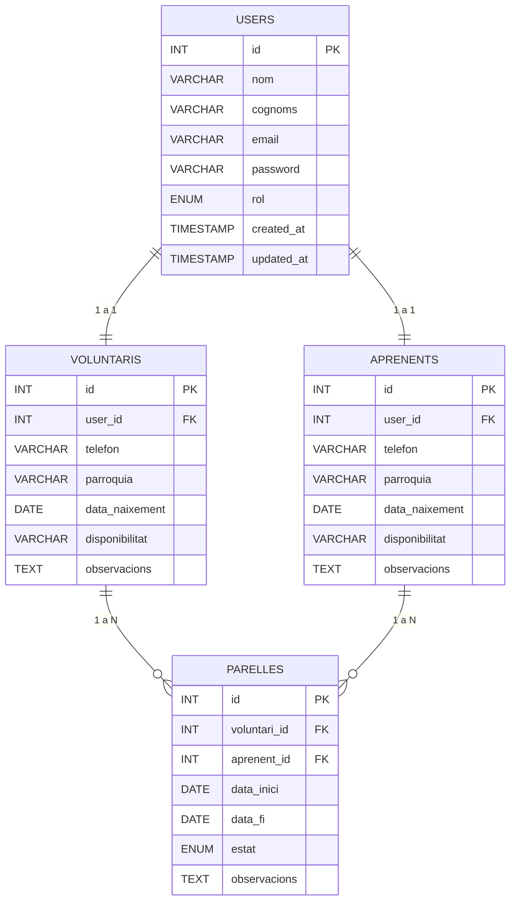

# UML Base de Dades (ER)

```mermaid
erDiagram
  USERS {
    INT id PK
    VARCHAR nom
    VARCHAR cognoms
    VARCHAR email
    VARCHAR password
    ENUM rol
    TIMESTAMP created_at
    TIMESTAMP updated_at
  }

  VOLUNTARIS {
    INT id PK
    INT user_id FK
    VARCHAR telefon
    VARCHAR parroquia
    DATE data_naixement
    VARCHAR disponibilitat
    TEXT observacions
  }

  APRENENTS {
    INT id PK
    INT user_id FK
    VARCHAR telefon
    VARCHAR parroquia
    DATE data_naixement
    VARCHAR disponibilitat
    TEXT observacions
  }

  PARELLES {
    INT id PK
    INT voluntari_id FK
    INT aprenent_id FK
    DATE data_inici
    DATE data_fi
    ENUM estat
    TEXT observacions
  }

  USERS ||--|| VOLUNTARIS : "1 a 1"
  USERS ||--|| APRENENTS : "1 a 1"
  VOLUNTARIS ||--o{ PARELLES : "1 a N"
  APRENENTS ||--o{ PARELLES : "1 a N"
```

Notes:
- `USERS` es la taula base d'autenticacio i rols.
- `VOLUNTARIS` i `APRENENTS` amplien dades de perfil per rol.
- `PARELLES` enlla?a un voluntari amb un aprenent.
